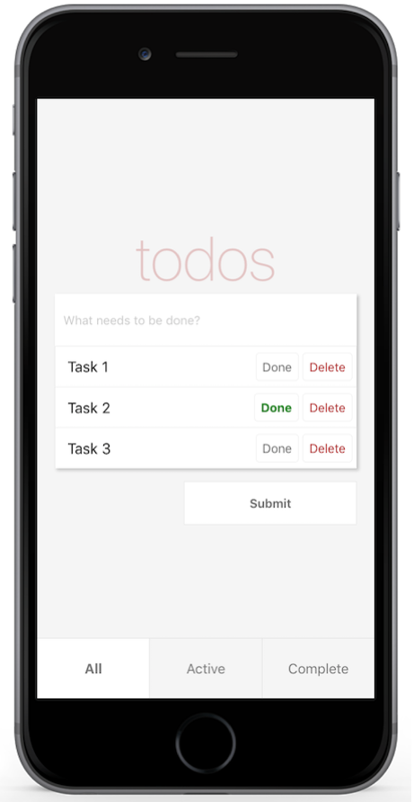
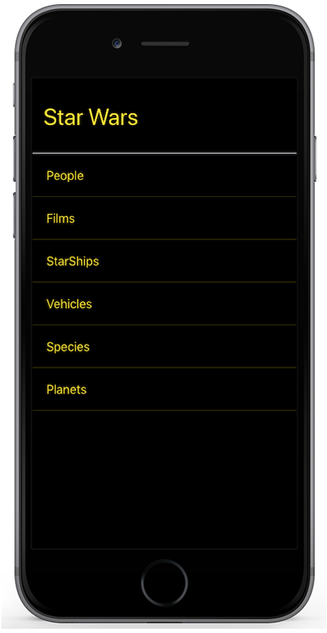

[](https://github.com/scommons/scommons-examples-mobile/actions/workflows/ci.yml?query=workflow%3Aci+branch%3Amaster)
[](https://coveralls.io/github/scommons/scommons-examples-mobile?branch=master)
[](https://www.scala-js.org)

## scommons-examples-mobile
Example applications that uses [Scala Commons](https://scommons.org/) `react-native` components/modules.

#### How to Build

To build and run tests use the following command:
```bash
sbt test
```

## Examples

[TodoApp](todos/expo) | [StarWarsApp](starwars/app)
--- | ---
 | 
