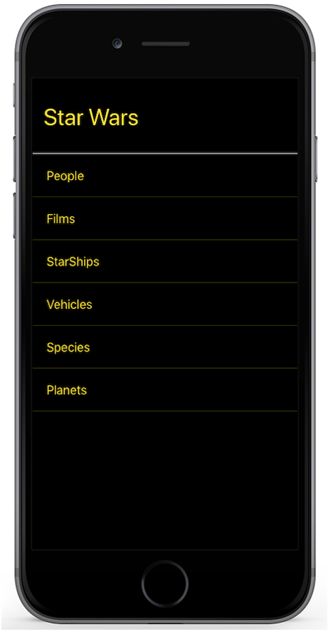

Welcome to the **Scala Commons Mobile Examples** documentation page!

Almost all examples are from an excellent book [React Native in Action](https://www.manning.com/books/react-native-in-action) by [Nader Dabit](https://github.com/dabit3)

### Overview

Example apps:

- [StarWarsApp](https://github.com/scommons/scommons-examples-mobile/tree/master/starwars/app)
  ([mobile](/scommons-examples-mobile/starwars.html), [web emulator](/scommons-examples-mobile/starwars.browser.html))

    
