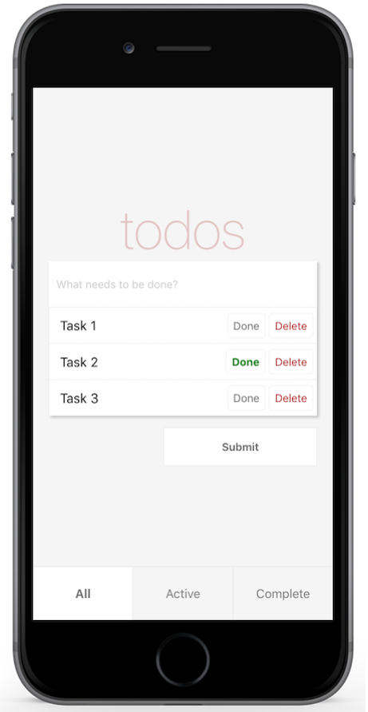

## scommons-examples-mobile-todos-expo

Example expo `react-native` `Todos` application written in `Scala.js`
from a great book: [React Native in Action](https://github.com/dabit3/react-native-in-action)



### How to Run App in your Device

* [live expo link](https://expo.io/@viktorpodzigun/todo-app)
* [mobile browser](https://scommons.org/scommons-examples-mobile/todos.html)
* [web emulator](https://scommons.org/scommons-examples-mobile/todos.browser.html)

### How to Build/Run App locally using Expo

First, build the app with the following command:
```bash
sbt "project scommons-examples-mobile-todos-expo" fastOptJS
```

Then, please make sure you have `expo-cli` **version 4** installed
globally:
```bash
npm i expo-cli@4 -g
```

To run the application locally, use the following command(s):
```bash
cd todos/expo
npm i #only on the first time and when upgrading
expo start --ios
expo start --web
expo start --android
```

To build web-assets, use the following command:
```bash
cd todos/expo
expo build:web --no-pwa
```
